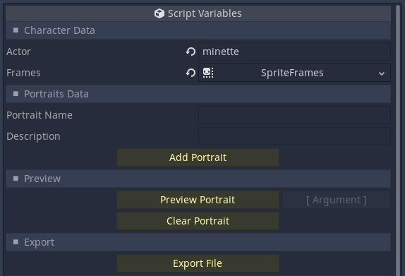
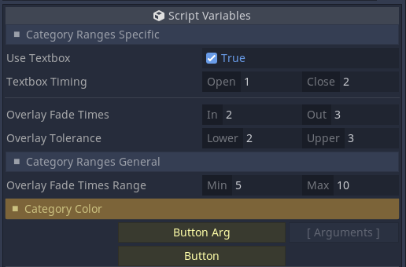
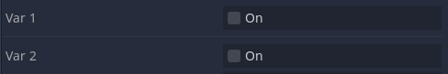
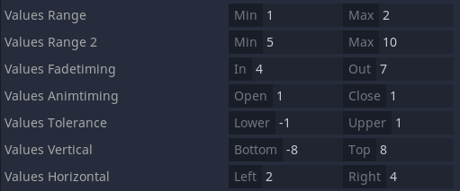
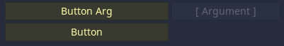

# ExportHelper for Godot 3.5 - by Allison Ghost

Export colorable inspector categories, variable separators, new types of booleans and vector ranges, and clickable buttons that can run script functions. All of it made easier than ever.
Serves as a replacement to mathewcst's [godot-export-categories](https://github.com/mathewcst/godot-export-categories)




## Usage

- Install and enable the plugin.

### Categories and Separators
- Use the `_c_` prefix on a variable to export a category.
- Export as a `Color` type with a default value to export a colored category.
- *Note: if changing the color of an exisitng category, you must comment out the export, save the script, then uncomment it and re-save the script for it to update.*

Examples:
```
export var _c_category_name:int
export var _c_category_color := Color.orange
```


- Use the `_sep_` prefix on a variable to export a horizontal separator:

Example: ```export var _sep_spacer:int```



### 'True' Booleans

- Use the `t_` prefix on a bool to export a checkbox that reads "True" (instead of "On") in the inspector.

Example: ```export (bool) var t_boolean = true```


### Vector Ranges

- Use the `_range` suffix on a Vector2 to export 2 fields to the editor that read "min" and "max". The suffix will be preserved.

The following suffixes can also be used to export Vector2 ranges, with more specific field tags. The suffixes on all these are removed.

- `_minmax` : Min, Max
- `_inout` : In, Out
- `_openclose` : Open, Close
- `_upperlower` : Lower, Upper
- `_topbottom` : Bottom, Top
- `_leftright` : Left, Right



### Buttons

- Use the `_btn_` prefix on a variable to export a clickable button.
- Create a function that the button will call, with a name matches the variable name but without the leading `_`

NOTE:
- Exporting an `int` or a `bool` type variable will export a standalone button.
- Exporting a `String` or other data type will export the button with an argument field that is passed to the function when clicked.
- The aforementioned argument field will have placeholder text determined by the variable's default string value.

Examples:
```
export (String) var _btn_button_arg = "Argument"
export (bool) var _btn_button

func btn_button_arg(entry):
	pass

func btn_button():
	pass

```


Clicking the button in the editor will run the associated function. Functions that modify the inspector or the object in the editor may still require use of the `tool` keyword in the script. Any arguments passed from the `Arguments` field, if there is one, will be automatically parsed to an `int`, `bool`, `float`, or `String` data type.
