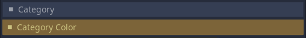

# ExportHelper for Godot 3.5 - by Allison Ghost

Export inspector categories and clickable buttons that run script functions.
Serves as a replacement to mathewcst's [godot-export-categories](https://github.com/mathewcst/godot-export-categories)


## Usage

- Install and enable the plugin.
- Use the `_c_` prefix on a variable to export a category:

Example: ```export var _c_category_name:int```



- Use the `_btn_` prefix on a variable to export a button
- Create a function that the button will call, with a name matches the variable name but without the leading `_`

NOTE:
- Exporting an `int` or a `bool` type variable will export a standalone button.
- Exporting a `String` or other data type will export the button with an argument field that is passed to the function when clicked.

Examples:
```
export (String) var _btn_button_arg = "test"
export (bool) var _btn_button

func btn_button_arg(entry):
	pass

func btn_button():
	pass

```


Clicking the button in the editor will run the associated function. Functions that modify the inspector or the object in the editor may still require use of the `tool` keyword in the script. Any arguments passed from the `Arguments` field, if there is one, will be automatically parsed to an `int`, `bool`, `float`, or `String` data type.
